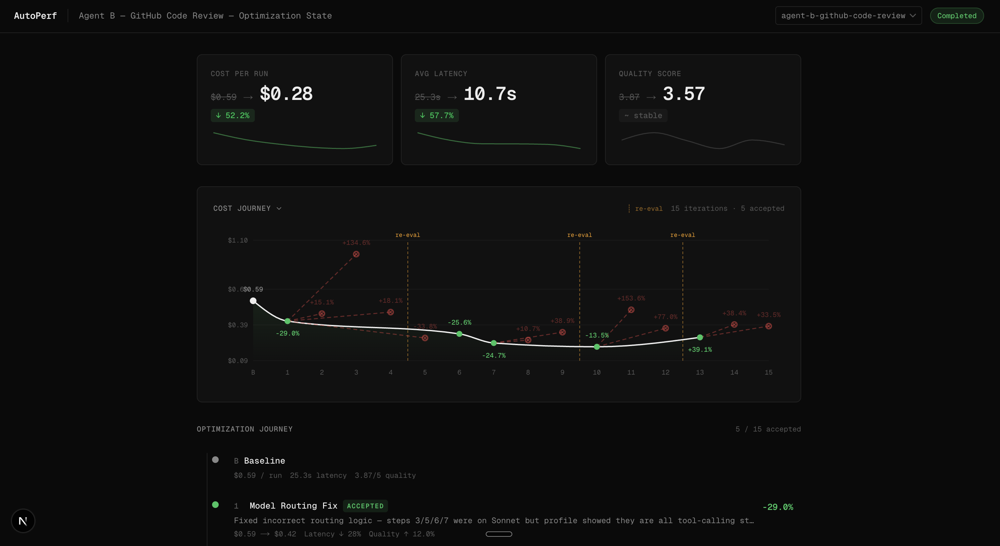

<div align="center">
  <picture>
    <source media="(prefers-color-scheme: dark)" srcset="assets/readme-hero-dark.svg">
    <source media="(prefers-color-scheme: light)" srcset="assets/readme-hero-light.svg">
    
  </picture>

  <h3>Autonomous agent optimization, powered by Claude Code</h3>

  <p>
    <a href="https://www.npmjs.com/package/autoperf-ai"></a>&nbsp;
    <a href="LICENSE"></a>&nbsp;
    <a href="https://github.com/aryandaga7/autoperf-ai/actions/workflows/ci.yml"></a>
  </p>
</div>

---

AutoPerf creates a controlled environment for Claude Code to autonomously optimize your AI agents. It evaluates baseline cost, quality, and latency, then spawns iteration agents in isolated git worktrees that research strategies, implement changes, and accept or reject based on statistical comparison.

The core insight: instead of manually tweaking prompts and swapping models, you give an LLM agent the right tools, documentation, and measurement infrastructure — and let it figure out what works.

[](https://youtu.be/W7GTINnu1h8)



## Why I Built This

I'm an ex-founder who shipped two AI agents to production. Through that I learned how much agent design matters — model routing, context management, caching, effort levels — but also that teams just guess at these optimizations. There's no systematic way to measure what actually works.

The research landscape confirmed the gap. [DSPy](https://github.com/stanfordnlp/dspy) and [MIPROv2](https://arxiv.org/abs/2406.11695) optimize prompt pipelines and module composition, but operate at the prompt level — not architecture. [AutoAgent](https://github.com/kevinrgu/autoagent) optimizes agent harnesses but is benchmark-focused. [Artemis](https://arxiv.org/abs/2512.09108) uses evolutionary search but is slow. No existing system combines architecture-level optimization (model selection, caching strategies, middleware, tool design) with statistical rigor and deep SDK integration.

AutoPerf follows the auto-research approach — using LLMs to improve LLM-based systems. The field is converging here: [GEPA](https://arxiv.org/abs/2507.19457) (ICLR 2026 Oral) showed that LLM agents reasoning about execution traces achieve 35x fewer rollouts than RL with better results.

## How It Works

```
autoperf eval     →  Measure baseline (cost, quality, latency per query)
autoperf optimize →  Autonomous optimization loop:
```

1. **Eval** — Runs your agent against a query set, scores quality via LLM-as-judge, measures cost and latency per step
2. **Spawn** — Creates a git worktree and launches an autonomous Claude Code iteration agent inside it
3. **Research** — The iteration agent reads performance profiles, a meta-knowledge library, and documentation from MCP servers to decide what to optimize
4. **Implement** — Makes the change, commits, writes reasoning
5. **Compare** — Re-evaluates and runs statistical comparison (Wilcoxon signed-rank, bootstrap CI, Cliff's Delta)
6. **Accept/Reject** — Passes? Fast-forward merge. Fails? Delete worktree. Main branch untouched.
7. **Repeat** until budget exhausted or diminishing returns

A visual report is auto-generated after each run — opens in your browser, no server needed.

### The environment is the insight

What makes the iteration agents effective is the curated environment they run in:

- **[Context7](https://context7.com)** and **[Nia](https://www.nozomi.ai)** MCP servers with documentation and best practices from Vercel AI SDK, ADK, LangChain, LangFuse, and other frameworks
- **Vercel skills** and **typescript-lsp** Claude Code plugins for SDK-aware code intelligence and verification
- **Meta-knowledge library** — a curated set of optimization strategies with evidence levels and expected impact (model routing, prompt caching, observation masking, effort levels, tool optimization, etc.)
- **Git worktree isolation** — each iteration gets a clean copy. No risk to your main branch.

All of this is configurable. The default setup targets Vercel AI SDK agents, but the MCP servers, skills, and meta-knowledge can be swapped for any framework or use case.

## Prerequisites

- **Node.js 20+**
- **`ANTHROPIC_API_KEY`** — for eval judging. Set in `.env` or environment.
- **Claude Code auth** — for `optimize` and `setup` only. `eval` works without it.
- Optional: `@ai-sdk/openai` or `@ai-sdk/google` for alternative judge models.

## Installation

No install required — run directly via npx:

```bash
npx autoperf-ai eval --help
```

Or install globally:

```bash
npm install -g autoperf-ai
```

## Quick Start

### 1. Evaluate your agent

```bash
export ANTHROPIC_API_KEY=sk-ant-...
npx autoperf-ai eval \
  --target ./my-agent \
  --queries ./my-agent/queries.json
```

Your agent directory needs `ai` and your provider SDK installed (`npm install ai @ai-sdk/anthropic`), and an `agent.ts` that exports `createAgent()`:

```typescript
// my-agent/agent.ts
import { ToolLoopAgent, tool } from "ai";
import { anthropic } from "@ai-sdk/anthropic";
import { z } from "zod";

export function createAgent() {
  return new ToolLoopAgent({
    model: anthropic("claude-sonnet-4-6"),
    tools: {
      myTool: tool({
        description: "Describe what this tool does",
        inputSchema: z.object({ input: z.string() }),
        execute: async ({ input }) => `result for ${input}`,
      }),
    },
  });
}
```

Returns `{ generate({ prompt }) }` → `{ text, steps? }`. Any AI SDK `ToolLoopAgent` works, or a plain object wrapping `generateText`.

### 2. Optimize

```bash
npx autoperf-ai optimize \
  --target ./my-agent \
  --queries ./my-agent/queries.json \
  --iterations 10
```

Requires [Claude Code](https://github.com/anthropics/claude-code) auth. Run `npx @anthropic-ai/claude-code auth login` once.

### Queries

```json
[
  {
    "query": "What's the weather in SF?",
    "expectedBehavior": "Calls weather tool, reports conditions",
    "shouldCallTool": true,
    "expectedTools": ["getWeather"]
  }
]
```

See [`examples/weather-agent/`](examples/weather-agent/) for a working example.

## Commands

| Command              | What it does                     | Requires CC? |
| -------------------- | -------------------------------- | ------------ |
| `autoperf eval`      | Measure baseline performance     | No           |
| `autoperf optimize`  | Run autonomous optimization loop | Yes          |
| `autoperf dashboard` | Visualize optimization results   | No           |
| `autoperf setup`     | Install CC plugins + MCP servers | Yes          |

### Key flags

| Flag               | Command        | Default             | Description                                  |
| ------------------ | -------------- | ------------------- | -------------------------------------------- |
| `--target`         | eval, optimize | _required_          | Path to agent directory with `agent.ts`      |
| `--queries`        | eval, optimize | _required_          | Path to `queries.json`                       |
| `--iterations`     | optimize       | `10`                | Max optimization iterations                  |
| `--model`          | optimize       | `opus`              | Orchestrator model                           |
| `--continue`       | optimize       | —                   | Resume from existing state                   |
| `--fresh`          | optimize       | —                   | Delete `.autoperf/{target}/` and start clean |
| `--concurrency`    | eval           | `3`                 | Parallel eval runs                           |
| `--runs-per-query` | eval           | `1`                 | Repeat each query N times (reduces noise)    |
| `--judge-model`    | eval           | `claude-sonnet-4-6` | Judge model ID. Requires provider's API key  |
| `--eval-tier`      | optimize       | `1`                 | Runs per query during optimization evals     |

## Safety

Optimization happens in isolated git worktrees. Your main branch is never modified until a change passes statistical validation. Rejected iterations delete the worktree entirely. The optimize command passes `--dangerously-skip-permissions` to Claude Code — the iteration agent operates in an isolated worktree, but review accepted changes before pushing.

## Contributing

```bash
git clone https://github.com/aryandaga7/autoperf-ai.git
cd autoperf-ai && npm install
npm run build -w packages/cli
node packages/cli/bin/autoperf.js --help
```

## License

[MIT](LICENSE)
